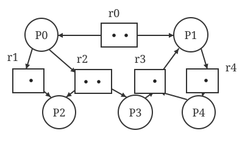
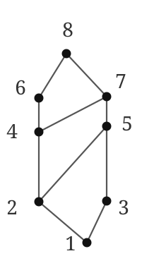
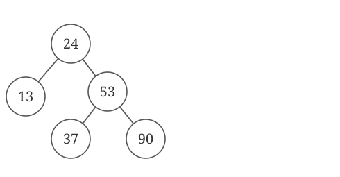
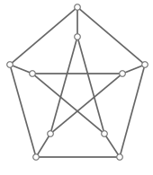
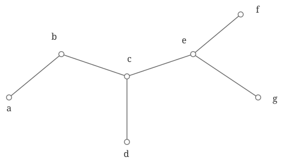
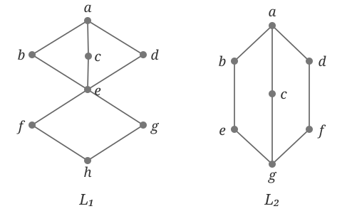
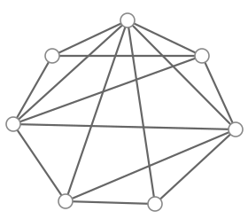

# 机考题目

## 单项选择

### 1. (2分)

Internet 中 MAC 地址和 IP 地址转换采用（ ）协议。

- [ ] ICMP (Internet Control Message Protocol)
- [x] ARP (Address Resolution Protocol)
- [ ] PPP (Point to Point Protocol)
- [ ] DHCP (Dynamic Host Configuration Protocol)

### 2. (2分)

在下列选项中，属于预防死锁的方法是（ ）。

- [ ] 资源随意分配
- [ ] 银行家算法
- [ ] 剥夺资源法
- [ ] 资源分配图简化法

### 3. (2分)

一棵哈夫曼树共有 215 个结点，对其进行哈夫曼编码，共能得到（ ）个不同的码字。

- [ ] 107
- [ ] 214
- [ ] 215
- [ ] 108

### 4. (2分)

一棵高度为 2 的 5 阶 B 树中，所含关键字的个数最少是（ ）。

- [ ] 8
- [ ] 7
- [ ] 5
- [ ] 14

### 5. (2分)

要保证数据库的逻辑数据独立性，需要修改的是（ ）。

- [ ] 模式与内模式之间的映象
- [ ] 模式
- [ ] 三级模式
- [ ] 模式与外模式之间的映象

### 6. (2分)

$A = {a, b}$ 上有（ ）种不同的偏序关系？

- [ ] 4
- [ ] 3
- [ ] 5
- [ ] 2

### 7. (2分)

下面关于 HTTP 协议的说法中，正确的是（ ）。

- [ ] HTTP 是一个普通用在浏览器和 Web 服务器之间进行数据交换的流式二进制协议
- [ ] HTTP1.0 中的 cache-control 响应头主要用于控制信息在浏览器的缓存
- [ ] HTTP 是基于 TCP 协议之上的应用层协议
- [ ] HTTP 协议是一种完全的非持久连接

### 8. (2分)

某硬盘有 200 个磁道（最外侧磁道号为 0），磁道访问请求序列为 130，42，180，15，199，当前磁头位于第 58 号磁道并从外侧向内侧移动。按照 SCAN 调度方法处理完上述请求后，磁头移过的磁道数是（ ）。

- [ ] 325
- [ ] 287
- [ ] 208
- [ ] 382

### 9. (2分)

已知有如下共用体变量的定义，则 `sizeof(test)` 的值是（ ）。

```c
union
{
    int i;
    char c;
    float a;
} test;
```

- [ ] 6
- [ ] 7
- [ ] 4
- [ ] 5

### 10. (2分)

数据链路层采用选择重传（SR）传输数据，发送方已经发送 0~3 号数据帧，现已收到 1 号帧的确认，0 和 2 号帧依次超时，现需要重发的帧数是（ ）。

- [ ] 0
- [ ] 1
- [ ] 3
- [ ] 2

### 11. (2分)

在关中断的情况下，不可响应的中断是（ ）。

- [ ] 软件中断
- [ ] 不可屏蔽中断
- [ ] 硬件中断
- [ ] 可屏蔽中断

### 12. (2分)

数据库恢复的基础是利用转储的冗余数据。这些转储的冗余数据包括（ ）。

- [ ] 数据字典、应用程序、审计档案、数据库后备副本
- [ ] 数据字典、应用程序、数据库后备副本
- [ ] 日志文件、数据库后备副本
- [ ] 数据字典、应用程序、日志文件、审计档案

### 13. (2分)

已知某省有 50 万考生，现需对其总成绩进行排序。下列排序方法中，（ ）所需平均时间开销最少。

- [ ] 归并排序
- [ ] 桶排序
- [ ] 堆排序
- [ ] 快速排序

### 14. (2分)

若有一个有向图的顶点不能排在一个拓扑序列中，则可判定该有向图（ ）。

- [ ] 是一个大根的有向图
- [ ] 含有顶点数目大于1的强连通分量
- [ ] 含有多个入度为0的顶点
- [ ] 是一个强连通图

### 15. (2分)

ping 命令是属于 TCP/IP 的（ ）。

- [ ] 数据链路层
- [ ] 表示层
- [ ] 应用层
- [ ] 网络层

### 16. (2分)

公式 $p \land r \land \neg ( q \to p )$ 是（ ）。

- [ ] 以上都不对
- [ ] 矛盾式
- [ ] 可满足式，但不是重言式
- [ ] 重言式

### 17. (2分)

直接封装 RIP，OSPF，BGP 报文的协议分别是（ ）。

- [ ] TCP，UDP，IP
- [ ] UDP，IP，TCP
- [ ] UDP，TCP，IP
- [ ] TCP，IP，UDP

### 18. (2分)

下面的代数系统 $(G,*)$ 中，（ ）不是群。

- [ ] G 为有理数集合，*为加法
- [ ] G 为有理数集合，*为乘法
- [ ] G 为偶数集合，*为加法
- [ ] G 为整数集合，*为加法

### 19. (2分)

下列程序的运行结果是（ ）。

```c
#include <stdio.h>
int try()
{
    static int x = 3;
    x++;
    return x;
}
main()
{
    int i,x;
    for (i = 0; i <= 2; i++)
        x = try();
    printf("%d\n", x);
}
```

- [ ] 6
- [ ] 4
- [ ] 3
- [ ] 5

### 20. (2分)

在下面的 I/O 控制方式中，需要 CPU 干预最少的方式是（ ）。

- [ ] 中断驱动 I/O 控制方式
- [ ] 直接存储器访问（DMA）控制方式
- [ ] 程序 I/O 方式
- [ ] I/O 通道控制方式

### 21. (2分)

以下程序的输出结果是（ ）。

```c
#define SQR(X) X*X
main()
{
    int a = 16, k = 2, m = 1;
    a /= SQR(k + m) / SQR(k + m);
    printf("%d\n", a);
}
```

- [ ] 16
- [ ] 2
- [ ] 9
- [ ] 1

### 22. (2分)

解决碎片问题，以及使程序可浮动的最好的办法是采用（ ）技术。

- [ ] 动态重定位
- [ ] 内存静态分配
- [ ] 静态重定位
- [ ] 内存动态分配

### 23. (2分)

下列编码中，（ ）不是前缀编码。

- [ ] $\{0, 10, 110, 111\}$
- [ ] $\{0, 1, 00, 11\}$
- [ ] $\{00, 01, 10, 11\}$
- [ ] $\{10, 110, 1110, 1111\}$

### 24. (2分)

设变量 `x` 为 `float` 型且已赋值，则以下语句中能将 `x` 中的数值保留到小数点后两位，并将第三位四舍五入的是（ ）。

- [ ] `x = (x * 100 + 0.5) / 100.0`;
- [ ] `x = x * 100 + 0.5 / 100.0`;
- [ ] `x = (x / 100 + 0.5) * 100.0`;
- [ ] `x = (int)(x * 100 + 0.5) / 100.0`;

### 25. (2分)

如果一个程序为多个进程所共享，且该程序的代码在执行过程中不能被修改，则该程序应该是（ ）。

- [ ] 可改变码
- [ ] 可运行码
- [ ] 可重入码
- [ ] 可连接码

### 26. (2分)

系统为某进程分配了 4 个页框，该进程已访问的页号序列为 1，0，2，7，3，4，2，8，3，4，8，4，5。若进程要访问的下一页的页号为 7，依据 LRU 算法，应淘汰页的页号是（ ）。

- [ ] 2
- [ ] 4
- [ ] 8
- [ ] 3

### 27. (2分)

将一个 C 类网络划分为 3 个子网，每个子网最少要容纳 55 台主机，则使用的子网掩码是（ ）。

- [ ] 255.255.255.252
- [ ] 255.255.255.224
- [ ] 255.255.255.192
- [ ] 255.255.255.248

### 28. (2分)

假设信道长度为 1200km，其往返时间为 20ms，分组长度为 1200bit，发送速率为 1Mb/s。若忽略处理时间和发送确认分组时间，则该信道的利用率为（ ）。

- [ ] 0.016
- [ ] 0.14
- [ ] 0.06
- [ ] 0.0566

### 29. (2分)

在下列关于 SPOOLing 的叙述中，描述不正确的是（ ）。

- [ ] SPOOLing 系统加快了作业执行的速度
- [ ] SPOOLing 系统主要目的是提升 I/O 设备效率
- [ ] SPOOLing 系统利用了处理器与通道并行工作的能力
- [ ] SPOOLing 系统使共享设备变成独占设备

### 30. (2分)

以下排序算法中，不稳定的是（ ）。

- [ ] 直接插入排序
- [ ] 归并排序
- [ ] 冒泡排序
- [ ] 希尔排序

### 31. (2分)

下列排序算法中，（ ）是不稳定的。

- [ ] 基数排序
- [ ] 起泡排序
- [ ] 堆排序
- [ ] 直接插入排序

### 32. (2分)

在关系模式 $R$ 中，若其函数依赖集中所有候选关键字都是决定因素，则 $R$ 最高范式是（ ）。

- [ ] 1NF
- [ ] BCNF
- [ ] 2NF
- [ ] 3NF

### 33. (2分)

已知两个长度分别为 $m$ 和 $n$ 的升序链表，若将它们合并为一个长度为 $m + n$ 的降序链表，则最坏情况下的时间复杂度是（ ）。

- [ ] $O(\text{min}(m, n))$
- [ ] $O(mn)$
- [ ] $O(m + n)$
- [ ] $O(\text{max}(m, n))$

### 34. (2分)

当局部 E-R 图合并成全局 E-R 图时可能出现冲突，不属于合并冲突的是（ ）。

- [ ] 语法冲突
- [ ] 命名冲突
- [ ] 结构冲突
- [ ] 属性冲突

### 35. (2分)

假设用下面语句申请一块动态内存，并用指针变量 `p` 指向它，用这块内存保存 `m * n` 个整型元素，即作为一个二维动态数组使用。通过 `p` 访问第 `i` 行第 `j` 列元素的正确方式是（ ）。

```c
p = (int*) malloc(m * n * sizeof(int));
/* 或者 */
p = (int*) calloc(m * n, sizeof(int));
```

- [ ] `*(*(p + i) + j)`
- [ ] `p[i][j]`
- [ ] `p[j * n + i]`
- [ ] `p[i * n + j]`

### 36. (2分)

下面描述中，错误的一条描述是（ ）。

- [ ] 文件的物理结构不仅与外存的分配方式相关，还与存储介质的特性相关，通常在磁带上只适合使用顺序结构。
- [ ] 一个文件在同一个系统中、不同的存储介质上的拷贝，应采用同一种物理结构。
- [ ] 虽然磁盘是随机访问的设备，但其中的文件也可以使用顺序结构。
- [ ] 采用顺序结构的文件既适合进行顺序访问，也适合进行随机访问。

### 37. (2分)

化简如下的资源分配图后，可以看出，处于死锁状态的进程包括（ ）。



- [ ] P1，P4
- [ ] P1，P3，P4
- [ ] P0，P1，P3，P4
- [ ] 以上都不对

### 38. (2分)

已知关系 $R = \{A, B, C, D, E, F\}$，$F = \{A \rightarrow C, BC \rightarrow DE, D \rightarrow E, CF \rightarrow B\}$。则 $(AB)F^{+}$ 的闭包是（ ）。

- [ ] $AB$
- [ ] $ABCDE$
- [ ] $ABC$
- [ ] $ABCDEF$

### 39. (2分)

若给定如下定义：

```c
int a[3][4], *p;
```

则以下不能对指针`p`进行初始化的是（ ）。

- [ ] `p = a;`
- [ ] `p = a[0];`
- [ ] `p = *a;`
- [ ] `p = &a[0][0];`

### 40. (2分)

数据库中，若事务 $T$ 对数据 $R$ 已加 $X$ 锁，则其他事务对 $R$（ ）。

- [ ] 不能加任何锁
- [ ] 可以加 $S$ 锁不能加 $X$ 锁
- [ ] 不能加 $S$ 锁可以加 $X$ 锁
- [ ] 可以加 $S$ 锁也可以加 $X$ 锁

### 41. (2分)

根据关系数据库规范化理论，关系数据库中的关系要满足第一范式。下面“部门”关系中，因（ ）属性而使它不满足第一范式。

`部门（部门号，部门名，部门成员，部门总经理）`

- [ ] 部门总经理
- [ ] 部门号
- [ ] 部门名
- [ ] 部门成员

### 42. (2分)

（ ）是 DBMS 的基本单位，它是用户定义的一组逻辑一致的程序序列。

- [ ] 程序
- [ ] 事务
- [ ] 命令
- [ ] 文件

### 43. (2分)

已知一棵有 2011 个结点的树，其叶结点个数是 116，该树对应的二叉树中无右孩子的结点个数是（ ）。

- [ ] 1895
- [ ] 115
- [ ] 1896
- [ ] 116

### 44. (2分)

对一组数据（2，12，16，88，5，10）进行排序，若前3趟排序结果如下：第一趟排序结果：2，12，16，5，10，88；第二趟排序结果：2，12，5，10，16，88；第三趟排序结果：2，5，10，12，16，88。则采用的排序方法可能是（ ）。

- [ ] 冒泡排序
- [ ] 希尔排序
- [ ] 基数排序
- [ ] 归并排序

### 45. (2分)

下列说法中，错误的是（ ）。

- [ ] $\exists z\,\forall x\,(F(z, y) \land (G(x) \to H(x,y)))$ 是 $\exists x\,F(x, y) \land \forall x\,(G(x) \to H(x,y))$ 的前束范式。
- [ ] 以上都不对。
- [ ] $\exists x\,\exists y\,(F(x) \land G(y))$ 是 $\exists x\,F(x) \land \exists y\,G(y)$ 的前束范式。
- [ ] $\forall x\,(F(x) \land G(x))$ 是 $\forall x\,F(x) \land \forall y\,G(y)$ 的前束范式。

### 46. (2分)

一棵二叉树的前序遍历序列为 1234567，它的中序遍历序列可能是（ ）。

- [ ] 1234567
- [ ] 3124567
- [ ] 4135627
- [ ] 1463572

### 47. (2分)

若一棵二叉树的前序遍历序列和后序遍历序列分别为 1，2，3，4 和 4，3，2，1，则该二叉树的中序遍历序列不会是（ ）。

- [ ] 1，2，3，4
- [ ] 3，2，4，1
- [ ] 2，3，4，1
- [ ] 4，3，2，1

### 48. (2分)

已知小根堆为 8，15，10，21，34，16，12，删除关键字 8 之后需重建堆，在此过程中，关键字之间的比较次数是（ ）。

- [ ] 4
- [ ] 1
- [ ] 3
- [ ] 2

### 49. (2分)

设 $G$ 有 6 个元素的循环群，$a$ 是生成元，则 $G$ 的子集（ ）是子群。（说明：$e$ 是单位元。）

- [ ] $\{e, a^3\}$
- [ ] $\{e, a, a^3\}$
- [ ] $\{a\}$
- [ ] $\{e, a\}$

### 50. (2分)

设 $\langle A, \leq \rangle$ 是一偏序集，$B$ 是 $A$ 的子集。则下面说法错误的是（ ）。

- [ ] 若 $b$ 是 $B$ 的最大元 ，则 $b$ 是 $B$ 的极大元、上界、最小上界
- [ ] 若 $B$ 存在最小上界，则 $B$ 的最小上界是唯一的
- [ ] 若 $a$ 是 $B$ 的最小上界，则 $a$ 是 $B$ 的最大元
- [ ] 若 $B$ 存在最大元，则 $B$ 的最大元是惟一的

### 51. (2分)

关系规范化中的插入操作异常是指（ ）。

- [ ] 应该插入的数据未被插入
- [ ] 应该删除的数据未被删除
- [ ] 不该删除的数据被删除
- [ ] 不该插入的数据被插入

### 52. (2分)

定义基本表时，若要求某一列的值是唯一的，则应在定义时使用（ ）保留字，但如果该列是主键，则可省写。

- [ ] `NULL`
- [ ] `UNIQUE`
- [ ] `DISTINCT`
- [ ] `NOT NULL`

### 53. (2分)

SMTP 协议是（ ）上的协议。

- [ ] 网络层
- [ ] 应用层
- [ ] 传输层
- [ ] 物理层

### 54. (2分)

文件传输协议 FTP 是（ ）上的协议。

- [ ] 网络层
- [ ] 物理层
- [ ] 运输层
- [ ] 应用层

### 55. (2分)

设有关系 $R(A, B, C)$ 和 $S(C, D)$。与 SQL 语句 `select A, B, D from R, S where R.C = S.C` 等价的关系代数表达式是（ ）。

- [ ] $\pi_{A, B, D}(\sigma_{R.C = S.C}(R \times S))$
- [ ] $\sigma_{R.C = S.C}(\pi_{A, B, D}(R \times S))$
- [ ] $\sigma_{R.C = S.C}((\pi_{A, B}(R)) \times (\pi_{D}(S)))$
- [ ] $\sigma_{R.C = S.C}(\pi_{D}((\pi_{A,B}(R)) \times S))$

### 56. (2分)

不考虑 Cache，段页式管理每取一次数据，要至少访问（ ）次内存。

- [ ] 2
- [ ] 4
- [ ] 1
- [ ] 3

### 57. (2分)

已知数据链路层采用后退 $N$ 帧（GBN）协议，且发送方已经发送了编号为 0~7 的帧。当计时器超时时，若发送方只收到 0、1、3 号帧的确认，则发送方需要重发的帧数是（ ）。

- [ ] 2
- [ ] 3
- [ ] 4
- [ ] 5

### 58. (2分)

若甲方向乙方发起一个 TCP 连接，最大段长 MSS = 1KB，RTT = 5ms，乙方开辟的接收缓存为 64KB，则甲方从连接建立成功至发送窗口达到 32KB，需要经过的时间至少是（ ）。

- [ ] 35ms
- [ ] 160ms
- [ ] 25ms
- [ ] 165ms

### 59. (2分)

下面有关 NAT 的描述，说法错误的是（ ）。

- [ ] 虚拟机里配置 NAT 模式，需要手工为虚拟系统配置 IP 地址、子网掩码，而且还要和宿主机器处于同一网段
- [ ] NAT 的实现方式有三种，即静态转换 Static Nat、动态转换 Dynamic Nat 和端口多路复用 OverLoad
- [ ] NAT 可以有效的解决了 IP 地址不足的问题
- [ ] NAT 是一种把内部私有网络地址（IP 地址）翻译成合法网络IP地址的技术

### 60. (2分)

利用栈求表达式的值时，设立运算符栈 `OPEN`。假设 `OPEN` 只有两个存储单元，则在下列表达式中，不会发生溢出的是（ ）。

- [ ] `(A-B)*C-D`
- [ ] `(A-B)*(C-D)`
- [ ] `(A-B*C)-D`
- [ ] `A-B*(C-D)`

### 61. (2分)

以下不能正确赋值的是（ ）。

- [ ] `char s4[4] = {'t', 'e', 's', 't'};`
- [ ] `char s3[20] = "test";`
- [ ] `char s1[10]; s1 = "test";`
- [ ] `char s2[] = {'t', 'e', 's', 't'};`

### 62. (2分)

用来实现进程同步与互斥的 PV 操作实际上是由（ ）过程组成的。

- [ ] 一个不可被中断的
- [ ] 两个可被中断的
- [ ] 两个不可被中断的
- [ ] 一个可被中断的

### 63. (2分)

$\forall x\,\exists y\,P(x, y)$ 的否定是（ ）。

- [ ] $\exists x\,\exists y\,\neg P(x, y)$
- [ ] $\exists x\,\forall y\,\neg P(x, y)$
- [ ] $\forall x\,\forall y\,\neg P(x, y)$
- [ ] $\forall x\,\exists y\,\neg P(x, y)$

### 64. (2分)

已知关系模式 $R(A, B)$ 属于 3NF，下列说法中，正确的是（ ）。

- [ ] 一定属于 BCNF
- [ ] 仍存在一定的插入和删除异常
- [ ] 它一定消除了插入和删除异常
- [ ] A 和 C 都是

### 65. (2分)

执行（ ）操作时，通常需要使用队列作为辅助存储空间。

- [ ] 查找散列（哈希）表
- [ ] 前序（根）遍历二叉树
- [ ] 深度优先搜索
- [ ] 广度优先搜索

### 66. (2分)

在请求分页存储管理方案中，若某用户空间为 16 个页面，页长 1KB，现有页表如下，则逻辑地址 `0A2CH` 所对应的物理地址为（ ）。

| 页号 | 页框号 |
| :-: | :-: |
| 0 | 1 |
| 1 | 5 |
| 2 | 3 |
| 3 | 4 |

- [ ] `302C(H)`
- [ ] `032C(H)`
- [ ] `1E2C(H)`
- [ ] `0E2C(H)`

### 67. (2分)

若 `w=1, x=2, y=3, z=4`，则条件表达式 `w < x ? w : y < z ? y : z` 的结果为（ ）。

- [ ] 4
- [ ] 3
- [ ] 2
- [ ] 1

### 68. (2分)

一组待排序序列为（46，79，56，38，40，84），则利用堆排序方法建立的初始堆为（ ）。

- [ ] 84，79，56，46，40，38
- [ ] 84，79，56，38，40，46
- [ ] 84，56，79，40，46，38
- [ ] 79，46，56，38，40，84

### 69. (2分)

所谓静态列级约束，就是（ ）。

- [ ] 对一个列的关系联系的说明
- [ ] 对一个行的取值域的说明
- [ ] 对一个列的取值域的说明
- [ ] 对一个列的横向联系的说明

### 70. (2分)

下列选项中，对正确接收到的数据帧进行确认的 MAC 协议是（ ）。

- [ ] CDMA
- [ ] CSMA
- [ ] CSMA/CD
- [ ] CSMA/CA

### 71. (2分)

设主存容量为 1MB，辅存容量为 400MB，计算机系统的地址寄存器有 24 位，那么虚存的最大容量是（ ）。

- [ ] $1$ MB
- [ ] $401$ MB
- [ ] $1$ MB + $2^{24}$ B
- [ ] $2^{24}$ B

### 72. (2分)

一个栈的输入序列为 1、2、3、4、5，下列序列中可能为栈的输出序列的是（ ）。

- [ ] 2、3、4、1、5
- [ ] 1、4、2、5、3
- [ ] 3、1、2、4、5
- [ ] 5、4、1、3、2

### 73. (2分)

以下程序执行后的输出结果是（ ）。

```c
void fun(int *a, int i, int j)
{
    int t;
    if(i < j)
    {
        t = a[i]; a[i] = a[j]; a[j] = t;
        fun(a, ++i, --j);
    }
}

main()
{
    int a[] = {1, 2, 3, 4, 5, 6}, i;
    fun(a, 0, 5);
    for(i = 0; i < 6; i++)
        printf("%d", a[i]);
}
```

- [ ] 6 3 2 1 5 4
- [ ] 1 2 3 4 5 6
- [ ] 6 5 4 3 2 1
- [ ] 4 6 5 1 2 3

### 74. (2分)

有以下程序：

```c
void f(int a[], int i, int j)
{
    int t;
    if(i < j)
    {
        t = a[i]; a[i] = a[j]; a[j] = t;
        f(a, i + 1, j - 1);
    }
}

main()
{
    int i, aa[5] = {1, 2, 3, 4, 5};
    f(aa, 0, 4);
    for(i = 0; i < 5; i++)
        printf("%d,", aa[i]);
    printf("\n");
}
```

执行后输出结果是（ ）。

- [ ] `5,4,3,2,1,`
- [ ] `5,2,3,4,1,`
- [ ] `1,2,3,4,5,`
- [ ] `1,4,3,2,5,`

### 75. (2分)

下面关于改善数据库性能的一些措施，说法不正确的是（ ）。

- [ ] 不少应用项目只需要数据在某一时间的值，在这种场合应尽可能使用快照。
- [ ] 数据库的性能与数据库的物理设计关系密切，数据库的逻辑设计对它没有影响。
- [ ] 关系的大小对查询速度影响很大，为提高查询速度，可以把一个大关系分解成很多小关系。
- [ ] 连接是开销比较大的运算，应该减少连接运算。

### 76. (2分)

银行家算法的数据结构包括可利用资源向量 `Available`、最大需求矩阵 `Max`、分配矩阵 `Allocation` 和需求矩阵 `Need`。下列选项中表述正确的是（ ）。

- [ ] `Need[i, j] = Max[i, j] + Allocation[i, j]`
- [ ] `Max[i, j] = Allocation[i, j] * Need[i, j]`
- [ ] `Max[i, j] = Allocation[i, j] - Need[i, j]`
- [ ] `Need[i, j] = Max[i, j] - Allocation[i, j]`

### 77. (2分)

关系模型中，一个关键字可由（ ）组成。

- [ ] 一个属性
- [ ] 以上都不对
- [ ] 一个或多个属性
- [ ] 多个属性

### 78. (2分)

给定声明 `int *p[10];`，下列说法中错误的是（ ）。

- [ ] `p` 中每个元素都是一个指针变量
- [ ] `p` 是数组名
- [ ] `p` 是一个指针数组
- [ ] `p++` 操作是合法的

### 79. (2分)

如下程序中，注释 1 和注释 2 处的输出结果是（ ）。

```c
#include <stdio.h>
main()
{
    union {
        int i[2];
        long k;
        char c[4];
    } t, *s = &t;
    s->i[0] = 0x39;
    s->i[1] = 0x38;
    printf("%lx\n", s->k);   /* 1 */
    printf("%c\n", s->c[0]); /* 2 */
}
```

- [ ] 380038，38
- [ ] 380039，39
- [ ] 380039，9
- [ ] 380038，8

### 80. (2分)

下面关于虚电路方式中路由选择的说法中，正确的是（ ）。

- [ ] 建立连接和发送数据都进行路由选择
- [ ] 传送数据时进行路由选择
- [ ] 只在建立虚电路时进行路由选择
- [ ] 建立连接和发送数据时都不进行路由选择

### 81. (2分)

对进程间互斥地使用临界资源的情况，进程可以（ ）。

- [ ] 互斥地进入各自的同类资源临界区
- [ ] 互斥地进入临界区
- [ ] 互斥地进入同一临界区
- [ ] 互斥地进入各自的临界区

### 82. (2分)

关系 $R$ 与关系 $S$ 只有 1 个公共属性。$T_1$ 是 $R$ 与 $S$ 作 $\theta$ 连接的结果，$T_2$ 是 $R$ 与 $S$ 作自然连接的结果，则（ ）。

- [ ] $T_1$ 的属性个数大于 $T_2$ 的属性个数
- [ ] $T_1$ 的属性个数小于 $T_2$ 的属性个数
- [ ] $T_1$ 的属性个数大于或等于 $T_2$ 的属性个数
- [ ] $T_1$ 的属性个数等于 $T_2$ 的属性个数

### 83. (2分)

关系模式 $R(x_1, x_2, x_3, x_4)$ 存在函数依赖 $x_1 \rightarrow x_2、x_1 \rightarrow x_3、x_3 \rightarrow x_4$，则该关系属于（ ）。

- [ ] BCNF
- [ ] 3NF
- [ ] 4NF
- [ ] 2NF

### 84. (2分)

下列排序算法中，某一趟结束后，未必能选出一个元素放在其最终位置上的是（ ）。

- [ ] 冒泡排序
- [ ] 快速排序
- [ ] 堆排序
- [ ] 直接插入排序

### 85. (2分)

在 OSI 参考模型中，下列功能需要由应用层的相邻层实现的是（ ）。

- [ ] 路由选择
- [ ] 对话管理
- [ ] 可靠数据传输
- [ ] 数据格式转换

### 86. (2分)

下列介质访问控制方法中，可能发生冲突的是（ ）。

- [ ] CDMA
- [ ] FDMA
- [ ] CSMA
- [ ] TDMA

### 87. (2分)

设循环队列存储在下标范围为 1 到 n 的一维数组中，队头指针为 `f`、队尾指针为 `r`，则队列元素个数为（ ）。

- [ ] $(r - f + n)\bmod n + 1$
- [ ] $(r - f)\bmod n + 1$
- [ ] $r - f + 1$
- [ ] $r - f$

### 88. (2分)

下列文件物理结构中，适合随机访问且易于文件扩展的是（ ）。

- [ ] 索引结构
- [ ] 链式结构且磁盘块变长
- [ ] 链式结构且磁盘块定长
- [ ] 连续结构

### 89. (2分)

下列协议中，在数据链路层的是（ ）。

- [ ] ARP
- [ ] ICMP
- [ ] UDP
- [ ] FTP
- [ ] HTTP

### 90. (2分)

下列页面置换算法中，（ ）会产生 Belady 现象。

- [ ] 先进先出（FIFO）
- [ ] 最近最少使用（LRU）
- [ ] 最不经常使用（LFU）
- [ ] 最佳置换

### 91. (2分)

TCP/IP 参考模型的网络层提供的是（ ）。

- [ ] 无连接可靠的数据报服务
- [ ] 无连接不可靠的数据报服务
- [ ] 有链接不可靠的虚电路服务
- [ ] 有链接可靠的虚电路服务

### 92. (2分)

设谓词 $P(x)$ 表示“$x$ 是奇数”，$Q(x)$ 表示“$x$ 是偶数”。谓词公式 $\exists x\,(P(x)\lor Q(x))$ 在个体域（ ）中为真。

- [ ] 以上都成立
- [ ] 自然数
- [ ] 实数
- [ ] 复数

### 93. (2分)

数据库管理系统能实现对数据库中数据表、索引等对象的定义、修改、删除，这类语言称为（ ）。

- [ ] 数据定义语言（DDL）
- [ ] 数据操纵语言（DML）
- [ ] 数据控制语言（DCL）
- [ ] 数据查询语言（DQL）

### 94. (2分)

已知某进程的段表内容如下所示。访问段号为 2、段内地址为 4000 的逻辑地址时，进行地址转换的结果是（ ）。

| 段号 | 段长 | 内存起始地址 | 权限 | 状态 |
| :-: | :-: | :-: | :-: | :-: |
| 0 | 100 | 6000 | 只读 | 在内存 |
| 1 | 200 | - | 读写 | 不在内存 |
| 2 | 300 | 4000 | 读写 | 在内存 |

- [ ] 越界异常
- [ ] 段缺失异常
- [ ] 越权异常
- [ ] 得到内存地址 4300

### 95. (2分)

以下磁盘调度算法中，（ ）可能出现“饥饿”现象。

- [ ] 电梯调度
- [ ] 先来先服务
- [ ] 循环扫描
- [ ] 最短寻道时间优先

### 96. (2分)

在一个采用 CSMA/CD 协议的网络中，传输介质是一根完整的电缆，传输速率为 1Gbit/s，电缆中的信号传播速度为 200000km/s，若最小数据帧减少 800bit，则最远的的两个站点之间的距离至少需要（ ）。

- [ ] 减少 80m
- [ ] 增加 160m
- [ ] 增加 80m
- [ ] 减少 160m

### 97. (2分)

以下程序运行后的输出结果是（ ）。

```c
void fun(char *a, char *b) {
    a = b; (*a)++;
}
main() {
    char c1 = 'A', c2 = 'a', *p1, *p2;
    p1 = &c1; p2 = &c2; fun(p1, p2);
    printf("%c%c\n", c1, c2);
}
```

- [ ] Ab
- [ ] aa
- [ ] Aa
- [ ] Bb

### 98. (2分)

用邻接表法存储图所用的空间大小

- [ ] 与图的顶点数和边数有关
- [ ] 只与图的边数有关
- [ ] 与边数的平方有关
- [ ] 只与图的顶点数有关

### 99. (2分)

已知 `a=15`，`b=240`，则 C 语言表达式 `(a&b)&b||b` 的结果是（ ）。

- [ ] `true`
- [ ] 0
- [ ] `false`
- [ ] 1

### 100. (2分)

IPv4 数据报分片的重组通常发生在（ ）。

- [ ] 数据报经过的路由器上
- [ ] 目的主机上
- [ ] 源主机和数据报经过的路由器上
- [ ] 源主机上

### 101. (2分)

执行下列程序时，若 `k` 输入为 1，则输出结果是（ ）。

```c
main() {
    int k;
    scanf("%d", &k);
    switch(k) {
        case 1:
            printf("%d",k++);
        case 2:
            printf("%d",k++);
        case 3:
            printf("%d",k++);
            break;
        default:
            printf("Full!");
    }
}
```

- [ ] 123
- [ ] 1
- [ ] 3
- [ ] 2

### 102. (2分)

文件系统采用多级目录结构的目的是（ ）。

- [ ] 缩短传送时间
- [ ] 减少系统开销
- [ ] 解决命名冲突
- [ ] 节省存储空间

### 103. (2分)

下列 SQL 语句中，能够实现“收回用户 ZHAO 对学生表（STUD）中学号（XH）的修改权”这一功能的是（ ）。

- [ ] `REVOKE UPDATE(XH) ON STUD FROM PUBLIC`
- [ ] `REVOKE UPDATE(XH) ON STUD FROM ZHAO`
- [ ] `REVOKE UPDATE(XH) ON TABLE FROM PUBLIC`
- [ ] `REVOKE UPDATE(XH) ON TABLE FROM ZHAO`

### 104. (2分)

下面程序段的时间复杂度是（ ）。

```c
i = s = 0;
while (s < n) {
    i++;
    s += i;
}
```

- [ ] $O(n)$
- [ ] $O(n\log n)$
- [ ] $O(n^2)$
- [ ] $O(\sqrt{n})$

### 105. (2分)

关于“死锁”，下列说法中正确的是（ ）。

- [ ] 在数据库操作中防止死锁的方法是禁止两个用户同时操作数据库
- [ ] 死锁是操作系统中的问题，数据库操作中不存在
- [ ] 当两个用户竞争相同资源时不会发生死锁
- [ ] 只有出现并发操作时，才有可能出现死锁

### 106. (2分)

已知 `int x; float y;`，`scanf` 调用语句的格式为 `scanf("x=%d, y=%f", &x, &y);`。若要将数据 10 和 66.6 分别赋给 `x` 和 `y`，正确的输入是（ ）。

- [ ] `x=10,y=66.6` 后回车
- [ ] `x=10` 后回车，再输入 `y=66.6` 后回车
- [ ] `x:10` 后回车，再输入 `y:66.6` 后回车
- [ ] `10,66.6` 后回车

### 107. (2分)

设 $U$ 是所有属性的集合，$X$、$Y$、$Z$ 都是 $U$ 的子集，且 $Z = U - X - Y$。下列关于多值依赖的叙述中，不正确的是（ ）。

- [ ] 若 $X \rightarrow\rightarrow Y$，且 $Y'\in Y$，则  $X \rightarrow\rightarrow Y'$
- [ ] 若 $Z \in \phi$，则 $X \rightarrow\rightarrow Y$
- [ ] 若 $X \rightarrow Y$，则 $X \rightarrow\rightarrow Y$
- [ ] 若  $X \rightarrow\rightarrow Y$，则 $X \rightarrow\rightarrow Z$

### 108. (2分)

在操作系统中，（ ）指的是一种硬件机制。

- [ ] 内存覆盖技术
- [ ] SPOOLing
- [ ] 缓冲池
- [ ] 通道技术

### 109. (2分)

事务的隔离性是指（ ）。

- [ ] 一个事务内部的操作及使用的数据对并发的其他事务是隔离的
- [ ] 事务中包括的所有操作要么都做，要么都不做
- [ ] 事务必须使数据库从一个一致性状态变到另一个一致性状态
- [ ] 事务一旦提交，对数据库的改变是永久的

### 110. (2分)

设无向图 $G$ 有 16 条边，且每个顶点的度数都是 2，则图 $G$ 有（ ）个顶点。

- [ ] 16
- [ ] 10
- [ ] 4
- [ ] 8

### 111. (2分)

广义表 $A=((a), a)$ 的表头和表尾分别是（ ）。

- [ ] 表头为 $(a)$，表尾为 $(a)$
- [ ] 表头为 $a$，表尾为 $a$
- [ ] 表头为 $(a)$，表尾为 $a$
- [ ] 表头为 $a$，表尾为 $(a)$

### 112. (2分)

已知一棵 5 阶 B 树中共有 53 个关键字，则树的最大高度为（ ）。

- [ ] 5
- [ ] 2
- [ ] 3
- [ ] 4

### 113. (2分)

某自治系统内采用 RIP 协议，若该自治系统内的路由器 R1 收到其邻居路由器 R2 的距离矢量，距离矢量包括信息 `net1, 16`，则能得出的结论是（ ）。

- [ ] R2 可以到达 net1，跳数为 16
- [ ] R1 可以经过 R2 到达 net1，跳数为 17
- [ ] R2 可以经过 R1 到达 net1，跳数为 17
- [ ] R1 不能经过 R2 到达 net1

### 114. (2分)

就平均性能而言，最好的内排序方法是（ ）。

- [ ] 直接插入排序
- [ ] 冒泡排序
- [ ] 希尔排序
- [ ] 快速排序

### 115. (2分)

视图消解的概念是（ ）。

- [ ] 将对视图的查询转换为对具体数据记录查询的过程
- [ ] 将对视图的查询转换为对基本表的查询的过程
- [ ] 将对视图的查询转换为逻辑查询的过程
- [ ] 将对视图的查询转换为对数据文件的查询的过程

### 116. (2分)

下面描述中，正确的一条描述是（ ）。

- [ ] 显式链接文件将分配给文件的下一个物理盘块的地址登记在该文件的前一个物理盘块中
- [ ] 顺序文件适合于建立在顺序存储设备上，而不适合建立在磁盘上
- [ ] 在 MS-DOS 中采用的是隐式链接文件结构
- [ ] 顺序文件必须采用连续分配方式，而链接文件和索引文件则可采用离散分配方式

### 117. (2分)

现有一个容量为 160GB 的磁盘分区，磁盘空间以簇为单位进行分配，簇的大小为 8KB，若采用位图法管理该分区的空闲空间，即用一位标识一个簇是否分配，则存放该位图的簇为（ ）个。

- [ ] 320K
- [ ] 160K
- [ ] 160
- [ ] 320

### 118. (2分)

下列说法中，（ ）不是磁盘设备的特点。

- [ ] 传输速率较高，以数据块为传输单位
- [ ] 一段时间内只允许一个用户（进程）访问
- [ ] I/O 控制方式常采用 DMA 方式
- [ ] 可以寻址，随机读 / 写任意数据块

### 119. (2分)

若一颗完全二叉树有 $2n - 1$ 个结点，则它有（ ）个叶子结点。

- [ ] $n$
- [ ] $n - 1$
- [ ] $2n$
- [ ] $2$

### 120. (2分)

关系数据库规范化是为了解决关系数据库中（ ）问题而引入的。

- [ ] 数据操作复杂性
- [ ] 数据访问安全性
- [ ] 检索速度
- [ ] 数据不一致性

### 121. (2分)

对于 100Mbps 的以太网交换机，当输出端口无排队，以直通交换（cut-through switching）方式转发一个以太网帧（不包括前导码）时，引入的转发延迟至少是（ ）。

- [ ] 121.44μs
- [ ] 0.48μs
- [ ] 5.12μs
- [ ] 0μs

### 122. (2分)

就计算机网络而言，在协议分层实现中，当数据分组从设备 A 传输到设备 B 时，在设备 A 的第 3 层加上首部分会在设备 B 的（ ）层被读出。

- [ ] 3
- [ ] 2
- [ ] 4
- [ ] 5

### 123. (2分)

设平面图 $G$ 是连通的，$G^*$ 是 $G$ 的对偶图，$G$ 的顶点数、边数、面数分别为 10、12、4，则 $G^*$ 的顶点数为（ ）。

- [ ] 4
- [ ] 10
- [ ] 12
- [ ] 26

### 124. (2分)

导致以下程序出现死循环的语句是（ ）。

```c
main() {
    int i = 0;
    while (i < 10) {
        if (i < 1) continue;
        if (i == 5) break;
        i++;
    }
/* ... */
}
```

- [ ] `if(i<1) continue;`
- [ ] `i++;`
- [ ] `if(i == 5) break;`
- [ ] 以上都不对，因为不会出现死循环

### 125. (2分)

文件索引结点中有 7 个地址项，其中 4 个为直接地址索引、2 个为一级间接地址索引、1 个为二级间接地址索引。每个地址项 4 字节，磁盘索引块和数据块均为 256 字节。可表示的单个文件最大长度是（ ）。

- [ ] 33KB
- [ ] 16513KB
- [ ] 1057KB
- [ ] 519KB

### 126. (2分)

站点 A、B、C 通过 CDMA 共享链路，A、B、C 的码片序列分别是 (1, 1, 1, 1)、(1, -1, 1, -1) 和 (1, 1, -1, -1)。若 C 从链路上收到的序列是 (2, 0, 2, 0, 0, -2, 0, -2, 0, 2, 0, 2)，则 C 收到 A 发送的数据是（ ）。

- [ ] 000
- [ ] 111
- [ ] 101
- [ ] 110

### 127. (2分)

进程和程序的一个本质区别是（ ）。

- [ ] 前者在一个文件中，后者在多个文件中
- [ ] 前者存储在内存，后者存储在外存
- [ ] 前者分时使用 CPU，后者独占 CPU
- [ ] 前者为动态的，后者为静态的

### 128. (2分)

在数据库的表定义中，限制成绩属性列的取值在 0 到 100 的范围内，属于数据的（ ）约束。

- [ ] 参照完整性
- [ ] 实体完整性
- [ ] 用户操作
- [ ] 用户自定义

### 129. (2分)

某计算机的指令流水线由四个功能段组成，指令流经各功能段的时间（忽略各功能段之间的缓存时间）分别为 90ns、80ns、70ns 和 60ns，则该计算机的 CPU 时钟周期至少是（ ）。

- [ ] 60ns
- [ ] 70ns
- [ ] 90ns
- [ ] 80ns

### 130. (2分)

主机甲与主机乙之间已建立一条 TCP 连接，双方持续有数据传输，且数据无差错与丢失。若甲收到一个来自乙的 TCP 报文段，该段的序号为 1913，确认序号为 2046，有效荷载为 100 字节，则甲立即发送给乙的报文段的序号和确认序号分别为（ ）。

- [ ] 2047，2012
- [ ] 2046，2012
- [ ] 2046，2013
- [ ] 2047，2013

### 131. (2分)

假如一个有向图具有有序的拓扑排序序列，那么，该图的邻接矩阵应为（ ）。

- [ ] 稀疏的
- [ ] 无规则的
- [ ] 三角的
- [ ] 对称的

### 132. (2分)

以下程序中，函数 `scmp` 的功能是返回形参指针 `s1` 和 `s2` 所指字符串中较小字符串的首地址。若运行时依次输入：`abcd`、`abba` 和 `abc` 三个字符串，则输出结果为（ ）。

```c
char *scmp(char *s1, char *s2)
{
    if (strcmp(s1, s2) < 0)
        return(s1);
    else
        return(s2);
}
main()
{
    int i;
    char string[20], str[3][20];
    for(i = 0; i < 3; i++) gets(str[i]);
    strcpy(string, scmp(str[0], str[1])); /* 库函数 strcpy 对字符串进行复制 */
    strcpy(string, scmp(string, str[2]));
    printf("%s\n", string);
}
```

- [ ] `abc`
- [ ] `abcd`
- [ ] `abba`
- [ ] `abca`

### 133. (2分)

若计算机主存地址为 32 位，按字节编址，Cache 数据区大小为 32KB，主存块大小为 32B，采用直接映射方式和回写（Write Back）策略，则 Cache 行的位数至少是（ ）。

- [ ] 275
- [ ] 257
- [ ] 274
- [ ] 258

### 134. (2分)

设与某资源关联的信号量初值为 3，当前值为 1。若 $M$ 表示该资源的可用个数，$N$ 表示等待该资源的进程数，则 $M$、$N$ 分别是（ ）。

- [ ] 2、0
- [ ] 1、2
- [ ] 1、0
- [ ] 0、1

### 135. (2分)

IEEE 802.11 无线局域网的 MAC 协议 CSMA/CA 进行信道预约的方法是（ ）。

- [ ] 使用多个 MAC 地址
- [ ] 发送确认帧
- [ ] 交换 RTS 与 CTS 帧
- [ ] 采用二进制指数退避

### 136. (2分)

某虚拟存储器系统采用页式内存管理，使用 LRU 页面替换算法，考虑页面访问地址序列 (3, 8, 1, 7, 8, 2, 7, 2, 1, 8, 3, 1, 2, 1, 3, 1, 7, 1, 2, 8)。假定内存容量为 4 个页面，开始时是空的，则页面失效次数是（ ）。

- [ ] 6
- [ ] 8
- [ ] 5
- [ ] 7

### 137. (2分)

一般来说，邻接多重表和十字链表分别用于存储（ ）。

- [ ] 无向图和无向图
- [ ] 无向图和有向图
- [ ] 有向图和有向图
- [ ] 有向图和无向图

### 138. (2分)

某基于动态分区存储管理的计算机，其主存容量为 55MB（初始为空闲），采用最佳适配（Best Fit）算法。分配和释放的顺序为：分配 15MB，分配 30MB，释放 15MB，分配 8MB，分配 6MB。此时主存中最大空闲分区的大小是（ ）。

- [ ] 10MB
- [ ] 15MB
- [ ] 7MB
- [ ] 9MB

### 139. (2分)

以下程序执行后，输出结果是（ ）。

```c
main() {
    char *p[10] = { "abc", "aabdfg", "dcdbe", "abbd", "cd" };
    printf("%d\n", strlen(p[4]));
}
```

- [ ] 4
- [ ] 3
- [ ] 5
- [ ] 2

### 140. (2分)

主机甲和主机乙已建立了 TCP 连接，甲始终以 MSS = 1KB 大小的段发送数据，并一直有数据发送；乙每收到一个数据段都会发出一个接收窗口为 10KB 的确认段。若甲在 $t$ 时刻发生超时时拥塞窗口为 8KB，则从 $t$ 时刻起，不再发生超时的情况下，经过 10 个 RTT 后，甲的发送窗口是（ ）。

- [ ] 10KB
- [ ] 12KB
- [ ] 14KB
- [ ] 5KB

### 141. (2分)

$A = \{1, 2, 3\}$，$R_1, R_2, R_3$ 是 $A$ 上的关系，其中 $R_1 = \{\langle 1,1 \rangle, \langle 2, 2 \rangle\}$，$R_2 = \{\langle 1, 1 \rangle, \langle 2,2 \rangle, \langle 3, 3 \rangle, \langle 1, 2\rangle\}$，$R_3 = \{\langle 1, 3 \rangle\}$。则以下满足自反的、反自反的、既不是自反的也不是反自反的关系的序列是（ ）。

- [ ] $R_2, R_3, R_1$
- [ ] $R_2, R_1, R_3$
- [ ] $R_1, R_3, R_2$
- [ ] $R_1, R_2, R_3$

### 142. (2分)

有两个并发执行的进程 `P1` 和 `P2`，共享初值为 1 的变量 `x`。`P1` 对 `x` 加 1，`P2` 对 `x` 减 1。加 1 和减 1 操作的指令序列分别如下所示。两个操作完成后，`x` 的值（ ）。

```text
// 加 1 操作
load R1, x    // 取 x 到寄存器 R1 中
inc R1
store x, R1   // 将 R1 的内容存入 x

// 减 1 操作
load R2, x
dec R2
store x, R2
```

- [ ] 只能为 1
- [ ] 可能为 0、1 或 2
- [ ] 可能为 -1 或 3
- [ ] 可能为 -1、0、1 或 2

### 143. (2分)

给定关键字序列 $(40, 35, 65, 97, 76, 11, 27, \underline{40})$，按快速排序方法对其从小到大排序。以第一个数为基准，进行一趟排序后的结果为（ ）。说明：$\underline{40}$ 加下划线是为了与前面的第一个关键字 $40$ 加以区分。

- [ ] $(27, 11, 35, 40, 76, 97, 65, \underline{40})$
- [ ] $(27, 35, 11, 40, 76, 97, 65, \underline{40})$
- [ ] $(27, 11, 35, \underline{40}, 76, 97, 65, 40)$
- [ ] 以上都不对

### 144. (2分)

在通信中要传输字母 a，b，c，d，e，f，g，它们出现的频率依次为 30%，20%，15%，10%，10%，9%，6%。假设已设计用于传输上述字母的最佳二元前缀码，则传输 100 个按上述频率出现的字母所需的二进制数字的个数为（ ）。

- [ ] 256
- [ ] 250
- [ ] 265
- [ ] 300

### 145. (2分)

有 10 台计算机建成 10Mbps 以太网，如分别采用共享以太网和交换以太网技术，则每个站点所获得的数据传输速率分别为

- [ ] 1Mbps，10Mbps
- [ ] 1Mbps，1Mbps
- [ ] 10Mbps，1Mbps
- [ ] 10Mbps，10Mbps

### 146. (2分)

以下策略中，能够用于判断有向图是否存在回路（环）的是（ ）。

- [ ] 拓扑排序
- [ ] 广度优先搜索
- [ ] 关键路径
- [ ] Dijkstra 算法

### 147. (2分)

对于二叉树的遍历算法，如果某结点 `m` 是另外一个结点 `n` 的祖先，那么采用（ ）方式可以找到 `m` 到 `n` 的一条路径。

- [ ] 层次遍历
- [ ] 后序遍历
- [ ] 中序遍历
- [ ] 先序遍历

### 148. (2分)

对于一棵 `m` 阶的 B 树，如下说法不正确的选项是（ ）。

- [ ] 树中所有每个结点至多有 `m` 棵子树
- [ ] 根结点至少有 2 棵子树
- [ ] 所有结点至少有 $\lceil \frac{m}{2} \rceil$ 棵子树
- [ ] 所有的终端结点（失败结点）都位于同一层

### 149. (2分)

某机器字长 16 位，主存按字节编址，转移指令采用相对寻址，由两个字节组成，第一字节为操作码字段，第二字节为相对位移量字段。假定取指令时，每取一个字节 `PC` 自动加 1。若某转移指令所在主存地址为 `3000H`，相对位移量字段的内容为 `06H`，则该转移指令成功转移后的目标地址是（ ）。

- [ ] `3008H`
- [ ] `3009H`
- [ ] `3007H`
- [ ] `3006H`

### 150. (2分)

假设某省的语文高考成绩保存在一个大数组中（按准考证号从小到大存放），且语文成绩为 0~150 之间的整数（含 0 和 150）。现要求对该数组进行按语文成绩从高到低的排序。针对该排序问题，速度最快且稳定的排序方法是（ ）。此处的稳定是指，当两个考生成绩相同时，准考证号小的排在前面。

- [ ] 快速排序
- [ ] 桶排序
- [ ] 归并排序
- [ ] 堆排序

### 151. (2分)

已知关系模式 $R(A, B, C, D, E, G, K)$，其最小函数依赖集 $F = \{ AB \to C, B \to DE, C \to G, G \to A\}$。依据数据库原理，下列说法中错误的是（ ）。

- [ ] `ABK` 是候选码
- [ ] `BGK` 是候选码
- [ ] `BCK` 是候选码
- [ ] 模式 $R$ 是 2NF

### 152. (2分)

下列关于交换机的叙述中，正确的是（ ）。

- [ ] 以太网交换机本质上是一种多端口网桥
- [ ] 交换机每个端口所连网络构成一个独立的广播域
- [ ] 以太网交换机可实现采用不同网络层协议的网络互联
- [ ] 通过交换机互连的一组工作站构成一个冲突域

### 153. (2分)

一组记录的关键字为 $\{18, 13, 22, 1, 67, 15, 82, 26, 54, 93, 8, 80\}$，采用链地址法构造哈希表，散列函数定义为 $H(\text{key}) = \text{key} \mod 13$。散列地址为 2 的链中记录数为（ ）。

- [ ] 2
- [ ] 5
- [ ] 3
- [ ] 4

### 154. (2分)

固态盘属于（ ）设备。

- [ ] 链接存取
- [ ] 直接存取
- [ ] 随机存取
- [ ] 顺序存取

### 155. (2分)

使用 SPOOLing 系统的目的是为了提高（ ）的使用效率。

- [ ] 操作系统
- [ ] 内存
- [ ] I/O 设备
- [ ] CPU

### 156. (2分)

主机甲通过 1 个路由器（存储转发方式）与主机乙互联，两段链路的数据传输速率均为 10Mbps。主机甲分别采用报文交换和分组大小为 10kb 的分组交换向主机乙发送 1 个大小为 8Mb（$1M = 10^6$）的报文。若忽略链路传播延迟、分组头开销和分组拆装时间，则两种交换方式完成该报文传输所需的总时间分别为（ ）。

- [ ] 1600ms，801ms
- [ ] 800ms，1600ms
- [ ] 1600ms，800ms
- [ ] 801ms，1600ms

### 157. (2分)

假设磁头当前位于第 105 道，且正在向磁道序号增加的方向移动。现有一个磁道访问请求序列为35，45，12，68，110，180，170，195，采用 SCAN 算法得到的磁道访问序列是（ ）。

- [ ] 110，170，180，195，12，35，45，68
- [ ] 12，35，45，68，110，170，180，195
- [ ] 110，68，45，35，12，170，180，195
- [ ] 110，170，180，195，68，45，36，12

### 158. (2分)

在关系模式 $R(A, B, C, D)$ 中，有函数依赖 $F=\{B \to C, C \to D, D \to A\}$，则 $R$ 可以达到（ ）。

- [ ] 1NF
- [ ] 2NF
- [ ] 以上三者都不可能
- [ ] 3NF

### 159. (2分)

下面程序的运行结果是（ ）。

```c
#include <stdio.h>

int Fun(int m) {
    static int n = 0;
    m /= 2;
    m = m * 2;
    if (m) {
        n *= m;
        return(Fun(m - 2));
    } else return n;
}

int main(void) {
    int a, i, j;
    for (i = 0; i < 2; i++) {
        a = Fun(4 + i);
        printf("%d,", a);
    }
    return 0;
}
```

- [ ] `8,8,`
- [ ] `4,4,`
- [ ] `64,64,`
- [ ] `0,0,`

### 160. (2分)

主机甲与主机乙之间使用后退 $N$ 帧协议（GBN）传输数据，甲的发送窗口尺寸为 1000，数据帧长为 1000 字节，信道带宽为 100Mbps。乙每收到一个数据帧立即利用一个短帧（忽略其传输延迟）进行确认。若甲、乙之间的单向传播延迟是 50ms，则甲可以达到的最大平均数据传输速率约为（ ）。

- [ ] 100Mbps
- [ ] 80Mbps
- [ ] 20Mbps
- [ ] 10Mbps

### 161. (2分)

E - R 方法的三要素是（ ）。

- [ ] 实体、域、候选键。
- [ ] 实体、属性、联系；
- [ ] 实体、键、联系；
- [ ] 实体、属性、实体集；

### 162. (2分)

用户进程通过 `read` 系统调用读取磁盘文件数据。下列叙述中正确的是（ ）。

1. 若文件数据不在内存，则该进程进入睡眠等待状态；
2. 请求 `read` 系统调用会导致 CPU 从用户态切换到核心态；
3. `read` 系统调用的参数应包含文件名。

- [ ] 仅 1、3
- [ ] 仅 2、3
- [ ] 仅 1、2
- [ ] 1、2、3

### 163. (2分)

冯·诺依曼计算机中，指令和数据均以二进制形式存放在存储器中，CPU 区分它们的依据是（ ）。

- [ ] 指令和数据所在的存储单元
- [ ] 指令和数据的寻址方式
- [ ] 指令操作码的译码结果
- [ ] 指令周期的不同阶段

### 164. (2分)

已知一个森林，若将其转换成等价的树和二叉树来存储，那么，如下说法正确的是（ ）。

- [ ] 该森林的先序遍历和树的后序遍历等价
- [ ] 该森林的中序遍历和对应二叉树的中序遍历等价
- [ ] 该树的先序遍历和对应二叉树的中序遍历等价
- [ ] 该树的中序遍历和对应二叉树的后序遍历等价

### 165. (2分)

下列关于 RISC 的叙述中，错误的是（ ）。

- [ ] RISC 大多数指令在一个时钟周期内完成
- [ ] RISC 的指令数、寻址方式和指令格式种类相对 CISC 少
- [ ] RISC 普遍采用微程序控制器
- [ ] RISC 的内部通用寄存器数量相对 CISC 多

### 166. (2分)

在字符串匹配算法中，假如主串长度为 $n$，模式串长度为 $m$（$m < n$），采用经典的字符串匹配 KMP 算法进行匹配，其算法时间复杂度是（ ）。

- [ ] $O(n)$
- [ ] $O(m+n)$
- [ ] $O(mn)$
- [ ] $O(m)$

### 167. (2分)

两台主机之间的数据链路层采用后退 $N$ 帧协议（GBN）传输数据，数据传输速率为 16 kbps，单向传播时延为 270ms，数据帧长度范围 128~512 字节，接收方总是以与数据帧等长的帧进行确认。为使信道利用率达到最高，帧序号的比特数至少为（ ）。

- [ ] 4
- [ ] 2
- [ ] 3
- [ ] 5

### 168. (2分)

下列函数的功能是（ ）。

```c
int fun(char *s) {
    char *t = s;
    while(*t++);
    return (t - s);
}
```

- [ ] 计算 `s` 所指字符串的长度
- [ ] 将 `s` 所指字符串复制到字符串 `t` 中
- [ ] 计算 `s` 所指字符串占用内存字节的个数
- [ ] 比较两个字符串大小

### 169. (2分)

已知系统为 32 位实地址，采用 48 位虚拟地址，页面大小 4KB，页表项大小为 8B；每段最大为 4GB。假设系统使用纯页式存储，则要采用多级页表的级数和页内偏移位数分别是（ ）。

- [ ] 4，12
- [ ] 3，12
- [ ] 4，11
- [ ] 3，11

### 170. (2分)

含有 $n$ 个元素的有序表，其二分（折半）查找所形成的判定树树高是（ ）。

- [ ] $\lceil \log_2(n + 1) \rceil$
- [ ] $\lfloor \log_2(n + 1) \rfloor - 1$
- [ ] $\lceil \log_2(n) \rceil$
- [ ] $\lfloor \log_2(n) \rfloor - 1$

### 171. (2分)

FTP 传输文件时使用的 TCP 连接是（ ）。

- [ ] 持久的数据连接
- [ ] 持久的控制连接
- [ ] 非持久的数据连接
- [ ] 非持久的控制连接

### 172. (2分)

偏序集 $\langle\{1, 2, 3, 4, 5, 6, 7, 8\}, \prec\rangle$ 的哈斯图如下，则 $B = \{2, 3, 4, 5, 7\}$ 时，$B$ 的上界和下界分别是（ ）。



- [ ] 7、8；1
- [ ] 7；1
- [ ] 8；1
- [ ] 7、8；1、2

### 173. (2分)

某路由器的路由表如下表所示。若路由器收到一个目的地址为 169.96.40.5 的 IP 分组，则转发该 IP 分组的接口是（ ）。

| 目的网络 | 下一跳 | 接口 |
| :- | :-: | :-: |
| 169.96.40.0/23 | 176.1.1.1 | S1 |
| 169.96.40.0/25 | 176.2.2.2 | S2 |
| 169.96.40.0/27 | 176.3.3.3 | S3 |
| 0.0.0.0/0 | 176.4.4.4 | S4 |

- [ ] S3
- [ ] S4
- [ ] S2
- [ ] S1

### 174. (2分)

顶点标定顺序的无向完全图 $K_n$（$n\geq 3$）中，在定义意义下共含有（ ）条不同的哈密顿回路。

- [ ] $2^n$
- [ ] 1
- [ ] $n!$
- [ ] $n$

### 175. (2分)

主机甲采用停 - 等协议向主机乙发送数据，数据传输速率是 3kbps，单向传播延时是 200ms，忽略确认帧的传输延时。当信道利用率等于 40% 时，数据帧的长度为（ ）。

- [ ] 800 比特
- [ ] 240 比特
- [ ] 400 比特
- [ ] 480 比特

### 176. (1分)

假设初始栈为空，将中缀表达式 `a/b+(c*d-e*f)/g+h/i` 转换为对应的后缀表达式过程中，当扫描到 `g` 时，操作符栈中存储的数据元素是（　）。

- [ ] `-*`
- [ ] `+`
- [ ] `+(*`
- [ ] `/+*`

### 177. (2分)

在关系模型中，为了实现“关系中不允许出现相同元组”的约束，应使用（ ）。

- [ ] 索引码
- [ ] 排序码
- [ ] 主码
- [ ] 外码

### 178. (2分)

一棵包含 1001 个结点的哈夫曼树，如果对其进行哈夫曼编码，可能存在的哈夫曼码字个数是（ ）。

- [ ] 501
- [ ] 500
- [ ] 502
- [ ] 503

### 179. (2分)

以下程序的输出结果是（ ）。

```c
int f()
{
    static int i = 0;
    int s = 1;
    s += i;
    i++;
    return s;
}
main()
{
    int i, a = 0;
    for (i = 0; i < 5; i++)
        a += f();
    printf("%d\n", a);
}
```

- [ ] 15
- [ ] 24
- [ ] 25
- [ ] 20

### 180. (2分)

若用邻接矩阵存储有向图，矩阵中主对角线以下的元素均为零，则关于该图拓扑序列的结论是（ ）。

- [ ] 存在，且唯一
- [ ] 无法确定是否存在
- [ ] 存在，且不唯一
- [ ] 存在，可能不唯一

### 181. (2分)

令 $F(x)$ 表示“$x$ 是实数”，$G(x)$ 表示“$x$ 是有理数”。命题“实数不全是有理数”的符号化形式可以表示为（ ）。

- [ ] $(\forall x\,F(x))\land(\exists x\,\neg G(x))$
- [ ] $\exists x\,(F(x)\rightarrow\neg G(x))$
- [ ] $\forall x\,(F(x)\rightarrow\neg G(x))$
- [ ] $\neg\forall x\,(F(x)\rightarrow G(x))$

### 182. (2分)

在 SQL Server 中，删除触发器使用（ ）。

- [ ] `DEALLOCATE`
- [ ] `ROLLBACK`
- [ ] `DELETE`
- [ ] `DROP`

### 183. (2分)

下列说法中，错误的是（ ）。

- [ ] $p\rightarrow(p\lor\neg q\lor r)$ 是重言式
- [ ] $\neg(p\leftrightarrow q)\leftrightarrow((p\land\neg q)\lor(\neg p\land q))$ 是重言式
- [ ] $(\neg(p\rightarrow q)\land q)\land r$ 是可满足式
- [ ] $\neg(((p\lor q)\land\neg p)\rightarrow q)$ 是矛盾式

### 184. (2分)

定义 `int a[9], *p = a;`，以后语句中未改变 `p` 的值。不能表示 `a[1]` 地址的表达式是（ ）。

- [ ] `a+1`
- [ ] `p+1`
- [ ] `a++`
- [ ] `++p`

### 185. (2分)

对于下列命中组合，一次访存过程中，不可能发生的是（ ）。

- [ ] TLB 命中，Cache 命中，Page 未命中
- [ ] TLB 命中，Cache 未命中，Page 命中
- [ ] TLB 未命中，Cache 命中，Page 命中
- [ ] TLB 未命中，Cache 未命中，Page 未命中

### 186. (2分)

内存动态分区管理中，最佳适应算法的空白区是（ ）。

- [ ] 按大小递增顺序排列的
- [ ] 按地址由大到小排列的
- [ ] 按大小递减顺序排列的
- [ ] 按地址由小到大排列的

### 187. (2分)

线索二叉树的说法正确的是（ ）。

- [ ] 引入线索二叉树能够更快地找到结点的后驱或后继
- [ ] 线索二叉树是一种逻辑结构
- [ ] 线索二叉树每一个结点都有指向前驱和后继的指针
- [ ] 引入线索二叉树的目的是为了方便二叉树的插入和删除

### 188. (2分)

给定如下程序段，执行该程序段后，`a` 的值为（ ）。

```c
int *p, a = 10, b = 1;
p = &a; a = *p + b;
```

- [ ] 10
- [ ] 11
- [ ] 编译出错
- [ ] 12

### 189. (2分)

下列选项给出的是从根分别到达两个叶结点路径上的权值序列，能属于同一棵哈夫曼树的是（ ）。

- [ ] 24，10，5 和 24，10，7
- [ ] 24，10，5 和 24，14，6
- [ ] 24，10，10 和 24，14，11
- [ ] 24，10，5 和 24，12，7

### 190. (2分)

对关系执行“投影”运算后，元组的个数与原关系中元组的个数（ ）。

- [ ] 小于元关系
- [ ] 大于原关系
- [ ] 相同
- [ ] 不大于原关系

### 191. (2分)

构造一个 7 层的平衡二叉树，需要的最小结点数是（ ）。

- [ ] 29
- [ ] 31
- [ ] 33
- [ ] 30

### 192. (2分)

下面的两个关系中，职工号和设备号分别为职工关系和设备关系的关键字：

```text
职工（职工号，职工名，部门号，职务，工资）
设备（设备号，职工号，设备名，数量）
```

在这两个关系的属性中，存在一个外关键字为（ ）。

- [ ] 设备关系的“职工号”
- [ ] 职工关系的“职工号”
- [ ] 职工关系的“设备号”
- [ ] 设备关系的“设备号”

### 193. (2分)

关系模式 $R$ 中若没有非主属性，则（ ）。

- [ ] $R$ 肯定属于 BCNF，但 $R$ 不一定属于 4NF
- [ ] $R$ 肯定属于 3NF，但 $R$ 不一定属于 BCNF
- [ ] $R$ 属于 2NF，但 $R$ 不一定属于 3NF
- [ ] $R$ 肯定属于 4NF

### 194. (2分)

$2 k + 1$ 阶轮图的点色数和边色数分别是（ ）。

- [ ] $2,\ 2k$
- [ ] $3,\ 2k$
- [ ] $2,\ 3k$
- [ ] $3,\ 3k$

### 195. (2分)

$K_{3, 4}$ 的点色数和边色数分别是（ ）。

- [ ] 4，2
- [ ] 2，3
- [ ] 2，4
- [ ] 3，2

### 196. (2分)

设有三个作业 J1、J2 和 J3。J1 的提交时间和所需运行时间分别为 0 和 4，J2 的提交时间和所需运行时间分别为 2 和 8，J3 的提交时间和所需运行时间分别为 3 和 5。若采用短作业优先调度策略，则该作业串的平均周转时间为（ ）。

- [ ] 25
- [ ] 8.33
- [ ] 17
- [ ] 5.67

### 197. (1分)

已知循环队列存储在一维数组 `A[0..n-1]` 中，且队列非空时 `front` 和 `rear` 分别指向队头元素和队尾元素。若初始时队列为空，且要求第 1 个进入队列的元素存储在 `A[0]` 处，则初始时 `front` 和 `rear` 的值分别是（ ）。

- [ ] `0`，`0`
- [ ] `n-1`，`0`
- [ ] `n-1`，`n-1`
- [ ] `0`，`n-1`

### 198. (2分)

系统总是访问磁盘的某个磁道而不响应对其他磁道的访问请求，这种现象称为磁臂黏着。下列磁盘调度算法中，不会导致磁臂黏着的是（ ）。

- [ ] 循环扫描算法（CSCAN）
- [ ] 先来先服务（FCFS）
- [ ] 扫描算法（SCAN）
- [ ] 最短寻道时间优先（SSTF）

### 199. (2分)

在下图所示的平衡二叉树中，插入关键字 48 后得到一棵新平衡二叉树。在新平衡二叉树中，关键字 37 所在结点的左、右子结点中保存的关键字分别是（ ）。



- [ ] 24，90
- [ ] 24，48
- [ ] 24，53
- [ ] 13，48

### 200. (2分)

将指令 Cache 与数据 Cache 分离的主要目的是（ ）。

- [ ] 提高 Cache 的命中率
- [ ] 降低 CPU 平均访存时间
- [ ] 降低 Cache 的缺失损失
- [ ] 减少指令流水线资源冲突

### 201. (2分)

在表或视图上执行除了（ ）以外的语句都可以激活触发器。

- [ ] `Create`
- [ ] `Delete`
- [ ] `Insert`
- [ ] `Update`

### 202. (2分)

以下程序运行后的输出结果是（ ）。

```c
int a = 3;
main() {
    int s = 0;
    { int a = 5; s += a++; }
    s += a++;
    printf("%d\n", s);
}
```

- [ ] 11
- [ ] 10
- [ ] 7
- [ ] 8

### 203. (2分)

彼得森图的点覆盖数 $\alpha_0$ 和边覆盖数 $\alpha_1$ 分别为（ ）。



- [ ] 5，6
- [ ] 6，4
- [ ] 4，6
- [ ] 6，5

### 204. (2分)

有六个元素 6，5，4，3，2，1 顺序入栈，下列（ ）不是合法的出栈序列。

- [ ] 453126
- [ ] 543612
- [ ] 346521
- [ ] 234156

### 205. (1分)

某队列允许在其两端进行入队操作，但仅允许在一端进行出队操作。若元素 a、b、c、d、e 依次入此队列后再进行出队操作，则不可能得到的出队序列是（ ）。

- [ ] d b c a e
- [ ] d b a c e
- [ ] e c b a d
- [ ] b a c d e

### 206. (2分)

下列语句中是真命题的为（ ）。

- [ ] 不准喧哗
- [ ] 如果 1 + 2 = 3，那么雪是黑的
- [ ] 我正在说谎
- [ ] 如果 1 + 2 = 4，那么雪是白的

### 207. (2分)

彼得森图的点独立数 $\beta_0$ 和匹配数 $\beta_1$ 分别是（ ）。


- [ ] 5，4
- [ ] 5，6
- [ ] 4，5
- [ ] 4，6

### 208. (2分)

当 $G$ 为有限群，子群 $H$ 所含元的个数与任一左陪集 $aH$ 所含元的个数（ ）。

- [ ] 以上都不对
- [ ] 可能相等，也可能不相等
- [ ] 相等
- [ ] 不相等

### 209. (1分)

设 $n$ 是描述问题规模的非负整数，下面程序片段的时间复杂度是（ ）。

```c
x = 2;
while (x < n / 2)
    x = 2 * x;
```

- [ ] $O(\log_2 n)$
- [ ] $O(n)$
- [ ] $O(n\log_2 n)$
- [ ] $O(n^2)$

### 210. (2分)

将关键字序列 69，33，59，73，70，72 和 71 依次插入后，构造成一棵二叉排序树，那么查找 71 要进行比较的次数是（ ）。

- [ ] 5
- [ ] 6
- [ ] 3
- [ ] 4

### 211. (2分)

有 $m$ 个进程共享同一临界资源。若使用信号量机制实现对这一临界资源的互斥访问，则信号量的变化范围是（ ）。

- [ ] $1$ 至 $-m$
- [ ] $1$ 至 $m$
- [ ] $1$ 至 $m-1$
- [ ] $1$ 至 $-(m-1)$

### 212. (2分)

将森林转换为对应的二叉树，若在二叉树中，结点 $u$ 是结点 $v$ 的父结点的父结点，则在原来的森林中，$u$ 和 $v$ 可能具有的关系是（ ）。

1. 父子关系
2. 兄弟关系
3. $u$ 的父节点和 $v$ 的父节点是兄弟关系

- [ ] 1，2，3
- [ ] 1，3
- [ ] 2
- [ ] 1，2

### 213. (2分)

在 `SELECT` 语句中，与关系代数中 $\sigma$（选择）运算符对应的是（ ）子句。

- [ ] `GROUP BY`
- [ ] `SELECT`
- [ ] `WHERE`
- [ ] `FROM`

### 214. (2分)

HTTP Cookie 是服务器发送到用户浏览器并保存在本地的一小段数据，浏览器在后续向同一服务器发起请求时会自动携带该 Cookie。下列叙述中，不属于 Cookie 技术典型用途的是（ ）。

- [ ] 缩短 Web 对象的响应时间
- [ ] 用户跟踪
- [ ] 个性化推荐
- [ ] 构建虚拟购物车

### 215. (2分)

若结点 `p` 与 `q` 在二叉搜索树 `T` 中的中序遍历中相邻，且 `p` 在 `q` 之前，则下列 `p` 与 `q` 的关系中，不可能的是（ ）。

1. `q` 是 `p` 的双亲
2. `q` 是 `p` 的右孩子
3. `q` 是 `p` 的右兄弟
4. `q` 是 `p` 的双亲的双亲

- [ ] 2，3
- [ ] 3
- [ ] 2，4
- [ ] 1

### 216. (2分)

设有关系模式 $R(X, Y, Z)$ 与它的函数依赖集 $F = \{ X \to Y, Y \to Z\}$，则 $F$ 的闭包 $F^+$ 中左部为 $(XY)$ 的函数依赖有（ ）个。

- [ ] 16
- [ ] 4
- [ ] 32
- [ ] 8

### 217. (2分)

有如下程序：

```c
main()
{
    FILE *fp1;
    fp1 = fopen("f1.txt", "w");
    fprintf(fp1, "abc");
    fclose(fp1);
}
```

若文本文件 `f1.txt` 中原有内容为 `good`，则运行以上程序后文件 `f1.txt` 中的内容为（ ）。

- [ ] `abcgood`
- [ ] `abc`
- [ ] `abcd`
- [ ] `goodabc`

### 218. (2分)

某请求分页存储系统的页大小为 4KB，按字节编址，系统给进程 P 分配 2 个固定的页框，并采用改进型 Clock 置换算法，进程 P 页表的部分内容见下表。若 P 访问虚拟地址为 `02A01H` 的存储单元，则经地址变换后得到的物理地址是（ ）。

| 页号 | 页框号 | 存在位 | 访问位 |
| :-: | - | :-: | :-: |
| ... | ... | ... | ... |
| 2 | 20H | 0 | 0 |
| 3 | 60H | 1 | 1 |
| 4 | 80H | 1 | 1 |
| ... | ... | ... | ... |

- [ ] `80A01H`
- [ ] `20A01H`
- [ ] `60A01H`
- [ ] `00A01H`

### 219. (2分)

Mysql 中表 `student_table(id, name, birth, sex)`，查询不重复的姓名总数，错误的是（ ）。

- [ ] `select count(name) from (select distinct name from student_table) t1;`
- [ ] `select count(distinct name) from student_table;`
- [ ] `select count(name) from (select name from student_table group by name) t1;`
- [ ] `select count(name) from (select name, count(*) as c1 from student_table group by name having c1 > 1) t1`

### 220. (2分)

下列关于银行家算法的叙述中，正确的是（ ）。

- [ ] 银行家算法破坏了死锁必要条件中的“请求和保持”条件
- [ ] 当系统处于不安全状态时，系统中一定会出现死锁进程
- [ ] 银行家算法可以预防死锁
- [ ] 当系统处于安全状态时，系统中一定无死锁进程

### 221. (2分)

某系统采用改进型 CLOCK 置换算法，页表项中字段 `A` 为访问位，`M` 为修改位。`A = 0` 表示页最近没有被访问过，`A = 1` 表示页最近被访问过。`M = 0` 表示页没有被修改过，`M = 1` 表示页被修改过。按 `(A, M)` 的取值，将页分为 4 类：`(0, 0)`，`(1, 0)`，`(0, 1)`，`(1, 1)`，则该算法淘汰页的次序为（ ）。

- [ ] `(0, 0)`，`(0, 1)`，`(1, 1)`，`(1, 0)`
- [ ] `(0, 0)`，`(0, 1)`，`(1, 0)`，`(1, 1)`
- [ ] `(0, 0)`，`(1, 0)`，`(0, 1)`，`(1, 1)`
- [ ] `(0, 0)`，`(1, 1)`，`(0, 1)`，`(1, 0)`

### 222. (2分)

假设系统中有 4 个同类资源，进程 P1、P2 和 P3 需要的资源数分别为 4、3 和 1，P1、P2 和 P3 已申请到的资源数分别为 2、1 和 0，则执行安全性检测算法的结果是（ ）。

- [ ] 不存在安全序列，系统处于不安全状态
- [ ] 存在多个安全序列，系统处于安全状态
- [ ] 存在唯一的安全序列 P3、P1、P2，系统处于安全状态
- [ ] 存在唯一安全序列 P3、P2、P1，系统处于安全状态

### 223. (2分)

以下错误的描述是（ ）。

- [ ] `break` 语句不能用于循环语句和 `switch` 语句外的任何其他语句
- [ ] 在循环语句中使用 `break` 语句是为了使流程跳出循环体，提前结束循环
- [ ] 在循环语句中使用 `continue` 语句是为了结束本次循环，而不是终止整个循环
- [ ] 在 `switch` 语句中使用 `break` 语句或 `continue` 语句的作用相同

### 224. (2分)

下图所示的平面图的面的次数是（ ）。



- [ ] 12
- [ ] 10
- [ ] 6
- [ ] 8

### 225. (2分)

设 $G=\langle R^*, \cdot\rangle$ 是非 0 实数关于乘法构成的群，下列说法中错误的是（ ）。

- [ ] $f(x)=|x|$ 是同态映射。
- [ ] $f(x)=2x$ 是同态映射。
- [ ] $f(x)=|x|$ 不是单同态。
- [ ] $f(x)=|x|$ 不是满同态。

### 226. (2分)

在 I/O 子系统中，由驱动程序和中断服务程序直接控制外设与主机之间的输入/输出操作，其中需要用到一些特权指令。特权指令只允许操作系统内核在内核态下执行，用户程序无权使用。下列指令中，不是特权指令的是（ ）。

- [ ] 关中断指令
- [ ] I/O 指令
- [ ] 系统调用指令
- [ ] 中断返回指令

### 227. (2分)

下面程序的输出是（ ）。

```c
main()
{
    int y = 9;
    for(; y > 0; --y) {
        if(y % 3 == 0) {
            printf("%d", y--);
            continue;
        }
    }
}
```

- [ ] 852
- [ ] 875421
- [ ] 963
- [ ] 741

### 228. (2分)

以下（ ）是不正确的。

```c
void fork1()
{
    printf("L0\n");
    if (fork() == 0) {
        printf("L1\n");
        if (fork() == 0) {
            printf("L2\n");
        }
    }
    printf("Bye\n");
}
```

- [ ] L0, Bye, L1, Bye, Bye, L2
- [ ] L0, Bye, L1, Bye, L2, Bye
- [ ] L0, L1, Bye, L2, Bye, Bye
- [ ] L0, Bye, L1, L2, Bye, Bye

### 229. (2分)

若大小为 12B 的应用层数据分别通过 1 个 UDP 数据报和 1 个 TCP 段传输，则该 UDP 数据报和 TCP 段实现的有效载荷（应用层数据）最大传输效率分别是（ ）。

- [ ] 60.0%，37.5%
- [ ] 60.0%，16.7%
- [ ] 37.5%，16.7%
- [ ] 37.5%，37.5%

### 230. (2分)

有以下程序：

```c
int *f(int *x, int *y)
{
    if(*x < *y) return x;
    else return y;
}

main()
{
    int a = 7, b = 8, *p, *q, *r;
    p = &a, q = &b; r = f(p, q);
    printf("%d,%d,%d\n", *p, *q, *r);
}
```

执行后输出结果是（ ）。

- [ ] `8,7,8`
- [ ] `8,7,7`
- [ ] `7,8,8`
- [ ] `7,8,7`

### 231. (2分)

给定如下所示的 $L_1, L_2$，下列说法中，错误的是（ ）。



- [ ] $L_1$ 是有补格。
- [ ] $L_2$ 不是分配格。
- [ ] $L_2$ 是有补格。
- [ ] $L_1$ 不是分配格。

### 232. (2分)

对磁盘上的两个文件 F1 和 F2，它们的第一个数据块分别为 22 和 16。给定 FAT 表项如下：`(14, 18)`；`(15, 17)`；`(16, 23)`；`(17, 21)`；`(18, 20)`；`(19, 15)`；`(20, -1)`；`(21, -1)`；`(22, 19)`；`(23, 14)`。在上面的符号中 `(x, y)` 表示存储在表项 `x` 中的值指向数据块 `y`。以下哪个数据块属于 F2？（ ）。

- [ ] 21
- [ ] 19
- [ ] 22
- [ ] 20

### 233. (2分)

下列程序的时间复杂度为（ ）。

```c
long fact(int n) {
    if (n == 0 || n == 1)
        return 1;
    else
        return n * fact(n - 1);
}
```

- [ ] $O(n^2)$
- [ ] $O(\log n)$
- [ ] $O(n)$
- [ ] $O(1)$

### 234. (2分)

某计算机按字节编址，数据 Cache 共有 1024 行，采用 4 路组相联映射方式，主存块大小为 32B。若访问主存地址为 1028 的 4 字节数据，则该数据所在主存块对应的 Cache 组号为（ ）。

- [ ] 16
- [ ] 64
- [ ] 32
- [ ] 4

### 235. (2分)

在一个 CDMA 网络中，某站点正接收另一码序列为 `(-1,1,1,-1,-1,-1,1,-1)` 的站点发送的数据，若该站点收到 `(-111-1-1-11-1 1-1-1111-11 1-1-1111-11 -111-1-1-11-1)`，则该站点收到的数据是（ ）。

- [ ] 1000
- [ ] 1001
- [ ] 0110
- [ ] 0001

### 236. (2分)

在计算 UDP 校验和时，封装 UDP 报文段的 IP 数据报首部某些字段也会参与计算，这些字段是（ ）。

1. 源 IP 地址
2. 目的 IP 地址
3. 协议
4. TTL

- [ ] 全部
- [ ] 3、4
- [ ] 1、2、3
- [ ] 1、2

### 237. (2分)

一个数学领域的猜想，名为六度分割理论或小世界理论。理论指出：你和任何一个陌生人之间所间隔的人不会超过六个，也就是说，最多通过 6 个中间人你就能够认识任何一个陌生人，这就是六度分割理论，也叫小世界理论。假设图 $G$ 中每一个人作为顶点，任意两个人之间是否认识（关联）为边，以“0 号人物”为起点，试设计一个尽可能高效的算法计算“0 号人物”到其他任意其他人之间的最快关联距离。这个相对较优的算法可以采用（ ）。

- [ ] 广度优先遍历
- [ ] 深度优先遍历
- [ ] Prim 算法
- [ ] 拓扑排序

### 238. (2分)

Oracle 数据库存储空间的最小 I/O 单位是（ ）。

- [ ] 数据块
- [ ] 表空间
- [ ] 段
- [ ] 区间

### 239. (2分)

给定 8 个叶子结点，其权值分别为 5，5，6，7，10，15，20，30。若用 Huffman 算法构造一棵最优二叉树（Huffman 树），则该树的带权路径长度 $W(T)$ 为（ ）。

- [ ] 266
- [ ] 268
- [ ] 256
- [ ] 267

### 240. (2分)

影响哈希查找（散列法）算法平均查找长度的是（ ）。

1. 装填因子
2. 散列函数
3. 解决冲突的策略

- [ ] 2、3
- [ ] 1、2、3
- [ ] 1
- [ ] 1、3

### 241. (2分)

假定以下程序经编译和连接后生成可执行文件 `PROG.exe`，如果在命令行窗口下键入命令：`PROG ABCDEFGH IJKL` 然后回车，则输出结果为（ ）。

```c
main(int argc, char *argv[]) {
    while(--argc > 0)
        printf("%s", argv[argc]);
    printf("\n");
}
```

- [ ] `ABCDEFGHIJKL`
- [ ] `IJKLABCDEFGH`
- [ ] `ABCDEFG`
- [ ] `IJHL`

### 242. (2分)

某网络中路由器采用支持毒性逆转技术的距离向量路由算法计算路由，若该网络内的路由器 R1 收到其唯一邻居路由器 R2 的距离向量中包含 $\langle 202.118/16, 10 \rangle$（距离为跳数），则 R1 更新后交换给 R2 的关于子网 202.118/16 的距离向量是（ ）。

- [ ] $\langle 202.118/16, 10 \rangle$
- [ ] $\langle 202.118/16, 11 \rangle$
- [ ] $\langle 202.118/16, 9 \rangle$
- [ ] $\langle 202.118/16, \infty \rangle$

### 243. (2分)

设森林 $F$ 中有 5 棵树，其结点个数分别为 2，3，4，5，7。按森林转换为二叉树的“左孩子右兄弟”规则，将 $F$ 转换成二叉树，所得二叉树的最小高度为（ ）。

- [ ] 10
- [ ] 6
- [ ] 8
- [ ] 5

### 244. (2分)

有如下的语句：`scanf("a=%d,b=%d,c=%d", &a, &b, &c);` 为使变量 `a` 的值为 1，`b` 的值为 2，`c` 的值为 3，从键盘输入数据的正确形式是（ ）。

- [ ] `a=1,b=3,c=2;`
- [ ] `32`
- [ ] `1,2,3`
- [ ] `a=1,b=2,c=3`

### 245. (2分)

在视图上不能完成的操作是（ ）。

- [ ] 更新视图数据
- [ ] 在视图上定义新的基本表
- [ ] 在视图上定义新的视图
- [ ] 查询

### 246. (2分)

在文件的索引结点中存放直接索引指针 10 个，一级和二级索引指针各 1 个。磁盘块大小为 1KB，每个索引指针占 4B。若某文件的索引结点已在内存中，则把该文件偏移量（按字节编址）为 1234 和 307400 所在的磁盘块读入内存，需要访问的磁盘块个数分别是（ ）。

- [ ] 1，2
- [ ] 2，3
- [ ] 2，4
- [ ] 1，3

### 247. (2分)

在分段存储管理系统中，用共享段表描述所有被共享的段，若进程 P1 和 P2 共享段 S，则下列叙述中，错误的是（ ）。

- [ ] 在物理内存中仅保存一份段 S 的内容
- [ ] P1 和 P2 都不再使用段 S 时才回收段 S 所占的内存空间
- [ ] P1 和 P2 共享段 S 在共享段表中的段表项
- [ ] 段 S 在 P1 和 P2 中应该具有相同的段号

### 248. (2分)

若将 IP 网络 123.4.4.0/22 划分为规模均衡的 32 个子网，则 IP 地址 123.4.5.11 所在的子网是（ ）。

- [ ] 123.4.4.0/27
- [ ] 123.4.5.32/27
- [ ] 123.4.5.192/27
- [ ] 123.4.5.0/27

### 249. (2分)

稀疏矩阵一般的压缩存储方法有两种，即（ ）。

- [ ] 三元组和十字链表
- [ ] 散列和十字链表
- [ ] 二维数组和三维数组
- [ ] 三元组和散列

### 250. (2分)

设有两门考试科目，成绩分别记为 $X$ 和 $Y$。现需对若干考生按以下规则进行排序：（1）首先按总成绩 $X+Y$ 由高到低排序；（2）总成绩相同时，按 $X$ 的成绩由高到低排序；（3）$X$ 也相同时，按 $Y$ 的成绩由高到低排序。若要求排序结果在上述多级排序规则下保持稳定性（即总成绩、$X$ 和 $Y$ 均相同的考生，排序后相对顺序不变），则下列排序算法中，最适合的是（ ）。

- [ ] 归并排序
- [ ] 希尔排序
- [ ] 快速排序
- [ ] 基数排序

### 251. (2分)

在 IEEE 802.11 无线局域网中，无线主机主动与 AP 关联时，发送的帧数是（ ）。

- [ ] 4
- [ ] 1
- [ ] 2
- [ ] 3

### 252. (2分)

主机甲通过一条链路连接主机乙，链路带宽为 10 Mbps（$M = 10^6$），单向传播延时为 7 ms。若甲采用 GBN 协议向乙发送帧长为 1000B 的数据帧，乙采用帧长为 250B 的确认帧进行确认，数据帧序号为 4 比特编号，则甲的最大信道利用率约为（ ）。

- [ ] 85%
- [ ] 100%
- [ ] 80%
- [ ] 10%

### 253. (2分)

下列有关基于时间片的进程调度的叙述中，错误的是（ ）。

- [ ] 当前进程的时间片用完后，该进程状态由执行态变为阻塞态
- [ ] 时钟中断发生后，系统会修改当前进程在时间片内的剩余时间
- [ ] 时间片越短，进程切换的次数越多，系统开销越大
- [ ] 影响时间片大小的主要因素包括响应时间、系统开销和进程数量

### 254. (2分)

具有 134 个结点的完全二叉树中，如果有 67 个叶结点，则一定有（ ）个度为 1 的结点。

- [ ] 2
- [ ] 1
- [ ] 5
- [ ] 9

### 255. (2分)

以下错误的描述是（ ）。

- [ ] 使用 while 和 do~while 循环时，循环变量初始化的操作应在循环语句之前完成
- [ ] while 循环是先判断表达式，后执行循环体语句
- [ ] do~while 和 for 循环均是先执行循环体语句，后判断表达式
- [ ] for、while、do~while 循环中的循环体均可由空语句构成

### 256. (2分)

一棵 $m$ 阶 B 树中，除根节点外，每个分支节点至少有（ ）个关键字。

- [ ] $\lfloor m/2 \rfloor -1$
- [ ] $\lfloor m/2 \rfloor$
- [ ] $\lfloor m/2 \rfloor +1$
- [ ] 以上都不是

### 257. (2分)

检索销量表中销量最好的商品 id 和销量，下列 SQL 语句正确的是（ ）。

- [ ] `SELECT 商品id, 销量 FROM 销量表 WHERE 销量 = MAX(销量);`
- [ ] `SELECT 商品id, 销量 FROM 销量表 WHERE 销量 = (SELECT MAX(销量) FROM 销量表);`
- [ ] `SELECT 商品id, MAX(销量) FROM 销量表 GROUP BY 销量;`
- [ ] `SELECT 商品id, MAX(销量) FROM 销量表 GROUP BY 商品id;`

### 258. (2分)

`GRANT` 命令属于（ ）操作。

- [ ] DCL
- [ ] DDL
- [ ] DQL
- [ ] DML

### 259. (2分)

已知关系模式 $R(A, B, C, D, E)$ 及其上的函数依赖集合 $F=\{A\rightarrow D, B\rightarrow C, E\rightarrow A\}$，该关系模式的候选关键字是（ ）。

- [ ] $BE$
- [ ] $AB$
- [ ] $CD$
- [ ] $DE$

### 260. (2分)

若某路由器需要向 MTU = 512B 的链路上转发一个 DF = 1、总长度为 1500B 的 IP 数据报，则路由器对该数据报的处理是（ ）。

- [ ] 丢弃
- [ ] 分为 4 片
- [ ] 分为 3 片
- [ ] 分为 5 片

## 判断

### 1. (1分)

设 $a$ 是 10 阶群的生成元，则 $a^3$ 是 10 阶元素。

- [ ] 是
- [ ] 否

### 2. (1分)

任意一个具有 2 个或以上元的半群，它一定是群。

- [ ] 是
- [ ] 否

### 3. (1分)

顶点数相同的极大平面图唯一。

- [ ] 是
- [ ] 否

### 4. (1分)

一个环 $R$ 对于加法来作成一个循环群，则 $R$ 是交换环。

- [ ] 是
- [ ] 否

### 5. (1分)

无向图 $G$ 是欧拉图当且仅当 $G$ 连通且无奇度数顶点。

- [ ] 是
- [ ] 否

### 6. (1分)

无向图 $G$ 是欧拉图当且仅当 $G$ 连通且恰有两个奇度顶点。

- [ ] 是
- [ ] 否

### 7. (1分)

希尔排序的组内排序一般采用的是“直接插入排序”的排序方法。

- [ ] 是
- [ ] 否

### 8. (1分)

图 $G$ 中有割边那么 $G$ 中一定有割点。

- [ ] 是
- [ ] 否

### 9. (1分)

对于 $n$ 阶对称矩阵，采用压缩存储时，所需要的顺序表表长为 $\frac{n(n-1)}{2}$。

- [ ] 是
- [ ] 否

### 10. (1分)

具有 8 个关键字的有序表中，对每一个关键字查找概率相同，如果采用折半查找算法，那么，查找不成功的平均查找长度是 27/7。

- [ ] 是
- [ ] 否

### 11. (1分)

$G$ 为无孤立点，则 $V^*$ 是极小（最小）点覆盖当且仅当 $\bar{V}^* = V - V^*$ 是极大（最大）点独立集。

- [ ] 是
- [ ] 否

### 12. (1分)

表达式 `a*(b+c)/d` 的后缀表达式是 `abc+*d-`。

- [ ] 是
- [ ] 否

### 13. (1分)

已知变量 `X`、`Y`、`Z` 的机器数分别为 `FFFDH`、`FFDFH` 和 `7FFCH`，若 `X`、`Y`、`Z` 为带符号整数（补码表示），则 `X<Y<Z`。

- [ ] 是
- [ ] 否

### 14. (1分)

数据库中，规范化的投影分解是唯一的。

- [ ] 是
- [ ] 否

### 15. (1分)

数据库关系模型中，3NF 是指满足 2NF 且不存在部分依赖现象。

- [ ] 是
- [ ] 否

### 16. (1分)

若 $k=125$，$q=8$，则 $k$ 在模 $q$ 下的乘法逆元是存在的。

- [ ] 是
- [ ] 否

### 17. (1分)

报文交换无需进行报文拆分与重组，因此比分组交换效率高。

- [ ] 是
- [ ] 否

### 18. (1分)

已知某计算机的 Cache 共有 16 块，采用 2 路组相联映射方式（即每组 2 块）；每个主存块大小为 32 字节，按字节编址。主存 129 号单元所在主存块应装入到的 Cache 组号是 4。

- [ ] 是
- [ ] 否

### 19. (1分)

简单图的点色数不会超过它的最大度 。

- [ ] 是
- [ ] 否

### 20. (1分)

在关系数据库中，依赖 $(S_\text{no}, C_\text{name}) \to (C_\text{name}, \text{Grade})$ 是平凡函数依赖。

- [ ] 是
- [ ] 否

### 21. (1分)

假设采用有向无环图存储和描述表达式 `(a-b)((a-b)/c)`，需要顶点数最少是 6。

- [ ] 是
- [ ] 否

### 22. (1分)

$n$ 个顶点、$e$ 条边构成的一个无向图，如果将其看成一个森林，那么该森林必有 $n-e$ 棵树。

- [ ] 是
- [ ] 否

### 23. (1分)

设 $R$ 与 $T$ 都是 $X$ 上的二元关系，如果 $R$ 和 $T$ 都是传递的，则 $R-T$ 也是传递的。

- [ ] 是
- [ ] 否

### 24. (1分)

假如一棵二叉树的先序遍历结果是 `ABCDEF`，中序遍历是 `CBADFE`，那么后续遍历结果是 `CBFEDA`。

- [ ] 是
- [ ] 否

### 25. (1分)

对于给定的如下所示的图 $G$，依据离散数学中关于平面图的定义，可知 $G$ 为平面图。



- [ ] 是
- [ ] 否

### 26. (1分)

MySQL 中表 `student_info(id, name, birth, sex)`，字段类型都是 `varchar`，插入如下记录：`('1014', '张三', '2002-01-06', '男')`，SQL 语句可以写为：

```sql
insert into table student_info values('1014','张三','2002-01-06','男');
```

- [ ] 是
- [ ] 否

### 27. (1分)

在 SQL 查询时，使用 `where` 子句指出的是查询目标。

- [ ] 是
- [ ] 否

### 28. (1分)

哈密顿图实际上是边不重的圈之并。

- [ ] 是
- [ ] 否

### 29. (1分)

假设有许多用户利用 BT（Bit Torrent）应用分发一个文件，若某 Peer 在某时刻正在向 $n$ 个对等端发送数据块，则 $n$ 的最大值是 4。

- [ ] 是
- [ ] 否

### 30. (1分)

设 $L$ 是有界分配格，如果补元存在，则它们是唯一的。

- [ ] 是
- [ ] 否

### 31. (1分)

若多个进程共享同一个文件 `F`，则各进程只能用“读”方式打开文件 `F`。

- [ ] 是
- [ ] 否

### 32. (1分)

假设所有变量均为整型，则表达式 `(a=2,b=5,b++,a+b)` 的值是 8。

- [ ] 是
- [ ] 否

### 33. (1分)

进程调度算法各种各样，如果选择不当，有的进程可能不能获得执行的机会，最后造成该进程死锁。

- [ ] 是
- [ ] 否

### 34. (1分)

在路由器体系结构中，完成路由表（或称转发表）检索与匹配，并决策转发路径的是输出端口。

- [ ] 是
- [ ] 否

### 35. (1分)

外码是指一个属性的值在一个关系中出现，必须在另一个关系中也出现。

- [ ] 是
- [ ] 否

### 36. (1分)

关于 C 语言程序：如果在程序中定义静态变量和全局变量时，未明确指明其初始值，那么它们可以在程序编译阶段自动被初始化为 0 值。

- [ ] 是
- [ ] 否

### 37. (1分)

若系统中的 $n$ 个进程（$n\geq2$），每个进程均需要使用某类临界资源 2 个，则系统不会发生死锁所需的该类资源总数至少为 $2n-1$。

- [ ] 是
- [ ] 否

### 38. (1分)

视图是一个虚拟表，并不表示任何物理数据，而只是用来查看数据的窗口而已。

- [ ] 是
- [ ] 否

### 39. (1分)

$\exists x\,(A(x)\rightarrow B(x))\leftrightarrow\forall x\,A(x)\rightarrow\exists x\,B(x)$ 不是重言式。

- [ ] 是
- [ ] 否

### 40. (1分)

虚电路网络可以确保携带相同虚电路号的系列分组按序到达目的。

- [ ] 是
- [ ] 否

### 41. (1分)

如果期望将一个较大广播域的网络分割为两个独立的较小广播域网络，可以采用的方案是将原网络划分为两个 VLAN。

- [ ] 是
- [ ] 否

### 42. (1分)

PPP 协议支持动态协商 IP 地址。

- [ ] 是
- [ ] 否

### 43. (1分)

$(\neg P\land(\neg Q\land R))\lor(Q\land R)\lor(P\land R)\leftrightarrow R$ 成立。

- [ ] 是
- [ ] 否

### 44. (1分)

使用 `INNER JOIN` 和 `LEFT JOIN` 在查询中可以实现相同的联接操作。

- [ ] 是
- [ ] 否

### 45. (1分)

在关系模式 $R$ 中，若没有非主属性，则 $R$ 属于 3NF，但 $R$ 不一定属于 BCNF。

- [ ] 是
- [ ] 否

### 46. (1分)

设 $S$ 是一个具有单位元 $e$ 的半群，若 $b$ 和 $b'$ 是 $a$ 的逆，则 $b = b'$。

- [ ] 是
- [ ] 否

### 47. (1分)

设有定义：`char a[4] = {1, 2, 3, 4};`，则数组元素 `a[2]` 的值为 2。

- [ ] 是
- [ ] 否

### 48. (1分)

某计算机采用 16 位定长指令字格式，操作码位数和寻址方式位数固定，指令系统有 48 条指令，支持直接、间接、立即、相对 4 种寻址方式，则单地址指令中直接寻址方式的可寻址范围是 0～255。

- [ ] 是
- [ ] 否

### 49. (1分)

若用数组名作为函数的实参，传递给形参的是数组第一个元素的地址值。

- [ ] 是
- [ ] 否

### 50. (1分)

向函数传递参数时，实参和形参可以重名。

- [ ] 是
- [ ] 否

### 51. (1分)

自然连接只从行的角度进行运算。

- [ ] 是
- [ ] 否

### 52. (1分)

内模式是面向数据库用户或应用程序的局部数据视图。

- [ ] 是
- [ ] 否

### 53. (1分)

假设一个采用 CSMA/CD 协议的 100Mb/s 局域网，最小帧长是 128B，则在一个冲突域内两个站点之间的单向传播延时最多是 5.12$\mu s$。

- [ ] 是
- [ ] 否

### 54. (1分)

一对多关系的建表原则是在多的一方建立外键指向一方的非主键字段。

- [ ] 是
- [ ] 否

### 55. (1分)

SQL 语言是过程化语言。

- [ ] 是
- [ ] 否

### 56. (1分)

数据模型分为层次模型、网状模型和关系模型。

- [ ] 是
- [ ] 否

### 57. (1分)

在最小函数依赖集 $F$ 中，$F$ 中的每个函数依赖的左部都是单属性。

- [ ] 是
- [ ] 否

### 58. (1分)

对于网络负载很重的无线网络，采用信道划分 MAC 协议比采用随机访问 MAC 协议的信道利用率更高。

- [ ] 是
- [ ] 否

### 59. (1分)

IPv6 地址空间是 IPv4 地址空间的 96 倍。

- [ ] 是
- [ ] 否

### 60. (1分)

发送方采用 CRC 计算数据校验码，采用的 CRC 生成多项式是 $x^6+x^4+x+1$。若发送的某个报文到达接收方为 `101011000110`，则所接收的报文是正确的。

- [ ] 是
- [ ] 否

### 61. (1分)

唯一标识一个 UDP 套接字的是目的 IP 地址和目的端口号。

- [ ] 是
- [ ] 否
